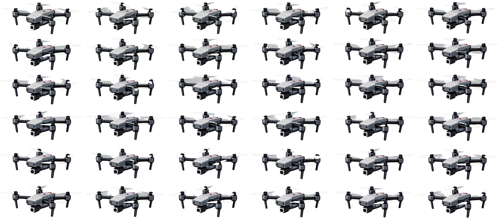

<div align="center">

  

  <h1>The Drone</h1>

  <p>
    <b>A gesture-controlled SDL2 drone animation where Python hand tracking drives a C renderer through a tiny file-based state bridge.</b>
  </p>

  <p>
    
    
    
    
    
  </p>

  <p>
    <a href="#features">
      
    </a>
    <a href="#controls">
      
    </a>
    <a href="#how-it-works">
      
    </a>
    <a href="#why-i-built-this">
      
    </a>
  </p>

</div>

---

## Overview

**The Drone** is a desktop experiment that connects real-time hand tracking to an SDL2 animation loop.

The project is split into two moving parts:

| Side | Responsibility |
| --- | --- |
| `app.py` | Opens the webcam, tracks a hand with MediaPipe, classifies gestures, and writes movement commands into `state.txt`. |
| `main.c` / `source.c` | Opens an SDL2 window, loads PNG assets, animates a drone sprite sheet, reads `state.txt`, and moves the drone around the scene. |

The result is a small computer-vision control system: hand gestures become text commands, and the C renderer turns those commands into drone movement.

## Features

<table>
  <tr>
    <td><b>Gesture control</b></td>
    <td>Uses webcam hand landmarks to choose movement directions.</td>
  </tr>
  <tr>
    <td><b>C/Python bridge</b></td>
    <td>Python writes commands to <code>state.txt</code>; the C renderer polls that file every frame.</td>
  </tr>
  <tr>
    <td><b>SDL2 renderer</b></td>
    <td>Draws a full <code>1280x720</code> scene with a background and animated drone.</td>
  </tr>
  <tr>
    <td><b>Sprite-sheet animation</b></td>
    <td>Treats <code>assets/drone.png</code> as a <code>6x6</code> animation sheet.</td>
  </tr>
  <tr>
    <td><b>Direction flipping</b></td>
    <td>Flips the drone horizontally when moving right.</td>
  </tr>
  <tr>
    <td><b>Keyboard fallback</b></td>
    <td>Arrow keys can move the drone even without camera tracking.</td>
  </tr>
  <tr>
    <td><b>Live camera window</b></td>
    <td>OpenCV shows the webcam feed and MediaPipe hand landmarks for debugging.</td>
  </tr>
</table>

## Tech Stack

<p>
  
  
  
  
  
  
  
  
</p>

| Layer | Technology | Role |
| --- | --- | --- |
| Renderer | `C`, `SDL2` | Window, event loop, texture drawing, sprite animation, keyboard fallback. |
| Image loading | `SDL2_image` | Loads drone, status, and background PNG assets. |
| Gesture detector | `Python`, `OpenCV`, `MediaPipe` | Captures camera frames and classifies hand poses. |
| IPC prototype | `state.txt` | Minimal file bridge between Python and C. |
| Assets | PNG sprite sheets/images | Drone animation, status graphic, and background scene. |

## Project Structure

```text
.
|-- app.py                  # OpenCV/MediaPipe hand tracker and state writer
|-- main.c                  # SDL2 app entry point, movement loop, texture loading
|-- source.c                # Drone sprite animation helpers
|-- headers.h               # SDL includes and function declarations
|-- state.txt               # Runtime command bridge: left/right/up/down/x
|-- assets/
|   |-- drone.png           # 6x6 animated drone sprite sheet
|   |-- dronestat.png       # Static drone/status asset
|   `-- epstein_island.png  # Background scene
|-- prot                    # Existing compiled/development artifact
`-- README.md
```

## Gesture Mapping

`app.py` classifies hand poses into movement commands:

| Gesture state | Written command | Drone movement |
| --- | --- | --- |
| Thumb closed, other fingers down | `left` | Move left |
| Thumb open, other fingers down | `right` | Move right |
| Index finger up only | `up` | Move up |
| Open hand with fingers up | `down` | Move down |
| Unknown/no hand | `x` | No gesture movement |

The Python process continuously rewrites `state.txt`. The C process reads the file and applies movement when the command matches a known direction.

## Controls

| Input | Action |
| --- | --- |
| Hand gesture: left state | Move drone left. |
| Hand gesture: right state | Move drone right. |
| Hand gesture: index up | Move drone up. |
| Hand gesture: open hand | Move drone down. |
| Arrow keys | Manual movement fallback. |
| `q` in webcam window | Quit the Python camera window. |
| SDL window close | Quit the SDL app. |

## Build

Install native dependencies on Ubuntu/Debian:

```bash
sudo apt install build-essential libsdl2-dev libsdl2-image-dev libsdl2-ttf-dev libsdl2-mixer-dev
```

Create the Python environment:

```bash
python3 -m venv venv311
source venv311/bin/activate
pip install opencv-python mediapipe
```

Compile the SDL2 renderer:

```bash
gcc main.c source.c -o drone \
  -lSDL2 -lSDL2_image -lSDL2_ttf -lSDL2_mixer
```

## Run

Run from the repository root so `state.txt` and `assets/` resolve correctly:

```bash
./drone
```

`main.c` currently starts the Python gesture detector automatically with:

```c
system("./venv311/bin/python app.py &");
```

You can also run the gesture detector manually in another terminal during debugging:

```bash
source venv311/bin/activate
python app.py
```

## How It Works

### 1. Python Gesture Detector

The detector opens the webcam through OpenCV, converts frames to RGB, and passes them into MediaPipe Hands.

It checks landmark distances and thumb/finger positions to classify a gesture, then writes a command string to `state.txt`.

### 2. File-Based State Bridge

The bridge is intentionally simple:

```text
Python camera process -> state.txt -> C SDL2 process
```

This makes the prototype easy to reason about because the renderer only needs to read a word like `left`, `right`, `up`, `down`, or `x`.

### 3. SDL2 Animation Loop

The renderer:

1. Opens a `1280x720` SDL2 window.
2. Loads the background and drone textures.
3. Reads `state.txt` every frame.
4. Moves the drone by a small amount for gesture input.
5. Accepts arrow-key movement as a fallback.
6. Advances the sprite animation frame every `50ms`.
7. Draws the background and drone to the window.

### 4. Sprite Sheet

`assets/drone.png` is split into a `6x6` grid:

```c
int framewidth = texw / 6;
int frameheight = texh / 6;
```

The current frame chooses one cell from that grid. When the drone moves right, SDL renders the same frame with `SDL_FLIP_HORIZONTAL`.

## Why I Built This

> well i plan on building an esp32 drone , or i am already building it , wanted to try and test the idea of controlling the drone with my hands so i made this little project

## Current Status

| Area | Status |
| --- | --- |
| SDL2 window/render loop | Working |
| Background rendering | Working |
| Drone sprite animation | Working |
| Keyboard fallback | Working |
| Python hand tracking | Working, camera/lighting dependent |
| File bridge through `state.txt` | Working prototype |
| Packaging/setup automation | Not implemented yet |

## Known Limitations

| Limitation | Current state |
| --- | --- |
| IPC | File polling works for a prototype but is less robust than sockets, pipes, or shared memory. |
| Process lifecycle | The C app starts Python in the background but does not manage shutdown. |
| Camera detection | Depends on lighting, camera quality, and hand position. |
| Paths | Python startup assumes `./venv311/bin/python` exists. |
| Bounds | Drone movement only does basic screen-bound checks. |
| State file | `state.txt` must exist and be readable from the repo root. |

## Roadmap Ideas

| Idea | Why it would help |
| --- | --- |
| Replace `state.txt` with sockets | Cleaner real-time communication between Python and C. |
| Add process cleanup | Stop the Python detector when the SDL app exits. |
| Add calibration mode | Make gestures more reliable across cameras and hands. |
| Add acceleration/smoothing | Make movement feel more physical. |
| Add obstacles/objectives | Turn the prototype into an actual mini-game. |
| Add on-screen status HUD | Show current gesture, command, and tracking confidence. |

---

<div align="center">
  <sub>Built with C, SDL2, Python, OpenCV, MediaPipe, and a tiny text-file bridge.</sub>
</div>
